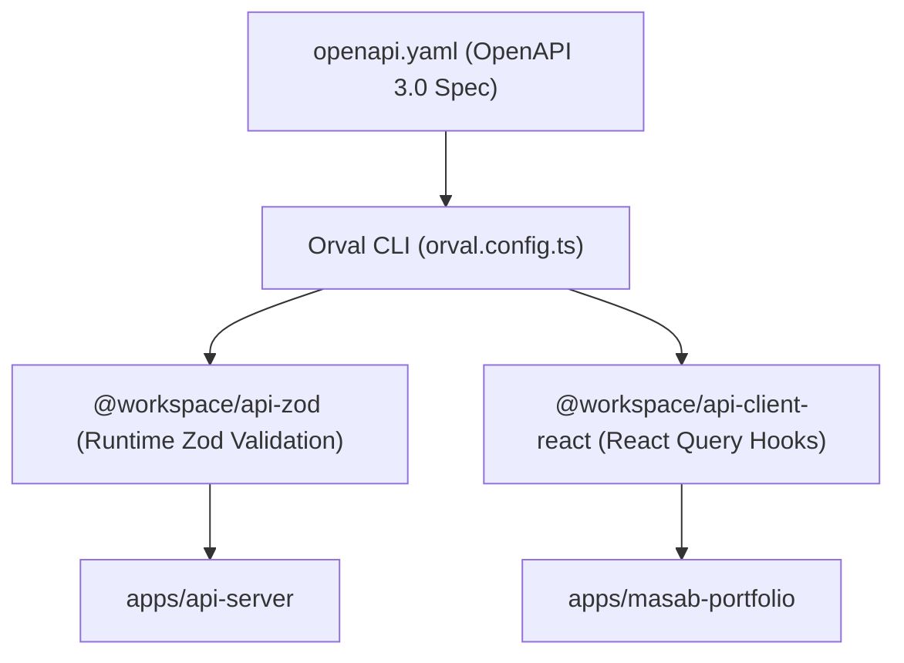

# @workspace/api-spec

OpenAPI 3.0 specification and automated code generation toolchain using **Orval**.

---

## 🚀 Overview

`@workspace/api-spec` acts as the **Single Source of Truth (SSOT)** for all API contracts across the monorepo. Instead of manually writing and syncing TypeScript types between the backend and frontend:

1. You define API endpoints, query params, request bodies, and responses in `openapi.yaml`.
2. Running the codegen script triggers **Orval**.
3. Orval compiles:
   - Type-safe **Zod schemas** into `@workspace/api-zod`.
   - Type-safe **TanStack React Query hooks** into `@workspace/api-client-react`.

---

## 📁 Directory Structure

```
packages/api-spec/
├── openapi.yaml               # OpenAPI 3.0 contract definition
├── orval.config.ts            # Orval code generation configuration
└── package.json
```

---

## 🛠 Available Scripts

Run from the root or within this directory:

| Command | Action |
| :--- | :--- |
| `pnpm --filter @workspace/api-spec run codegen` | Generates Zod schemas and React Query hooks from `openapi.yaml`, then runs library typecheck |

---

## 🔄 Codegen Workflow



### Adding or Updating Endpoints:
1. Update `packages/api-spec/openapi.yaml` with your new route or schema.
2. Run:
   ```bash
   pnpm --filter @workspace/api-spec run codegen
   ```
3. Import the generated Zod validation in `apps/api-server` or the React Query hook in `apps/masab-portfolio`.
